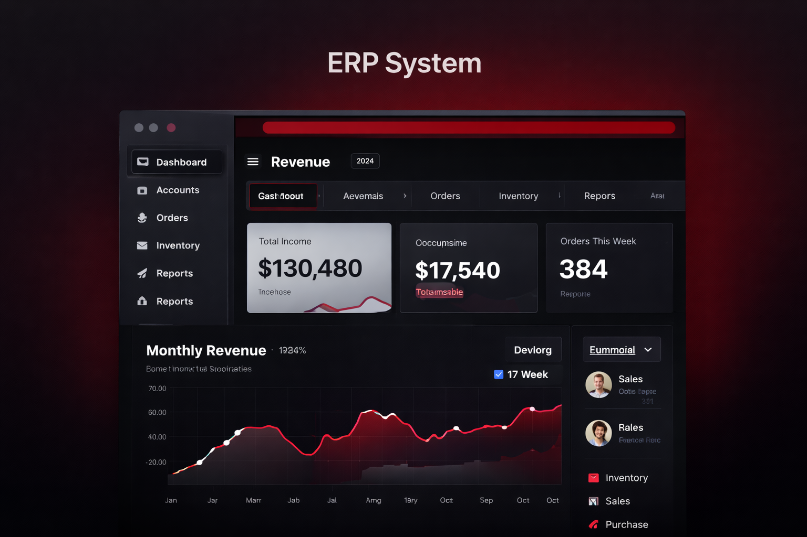

  

<h1 align="center">Gobinda Sharma</h1>

  

  
  
  
  

  💼 Building real-world ERP, SaaS & dashboard systems for modern businesses

  
  
  
  

## 🚀 What I Do

- 🎨 UI/UX Design (Modern, User-Centered Interfaces)
- 🧑‍💼 Project Management (System Planning & Execution)
- 🧾 ERP System Development (Inventory, Accounting, Reports)
- 📊 SaaS Platforms (Multi-tenant, Role-based Systems)

## 💼 Experience

**UI/UX Designer & Project Manager**  
🏢 Pravidhi Digital Innovation  

✔ Managing real-world SaaS & ERP projects  
✔ Designing user-friendly dashboards  
✔ Coordinating development workflows  

## 🚀 Featured Projects

### 🧾 ERP System

  

✔ Inventory, Sales, Purchase  
✔ Financial Reports (P&L, Balance Sheet)  

  

### 🧑‍💼 Manpower SaaS

  

✔ Multi-tenant platform  
✔ Candidate privacy system  

  
  

### 🍽️ Restaurant POS

  

✔ QR Ordering + KOT  
✔ Billing + Cash Control  

  
  

## 🛠 Tech Stack

  

## 📊 GitHub Overview

  
  

  

  

## 🎥 Demo Showcase

  

  Add your YouTube walkthrough link here

  

  💼 Available for SaaS, ERP & dashboard development projects worldwide

