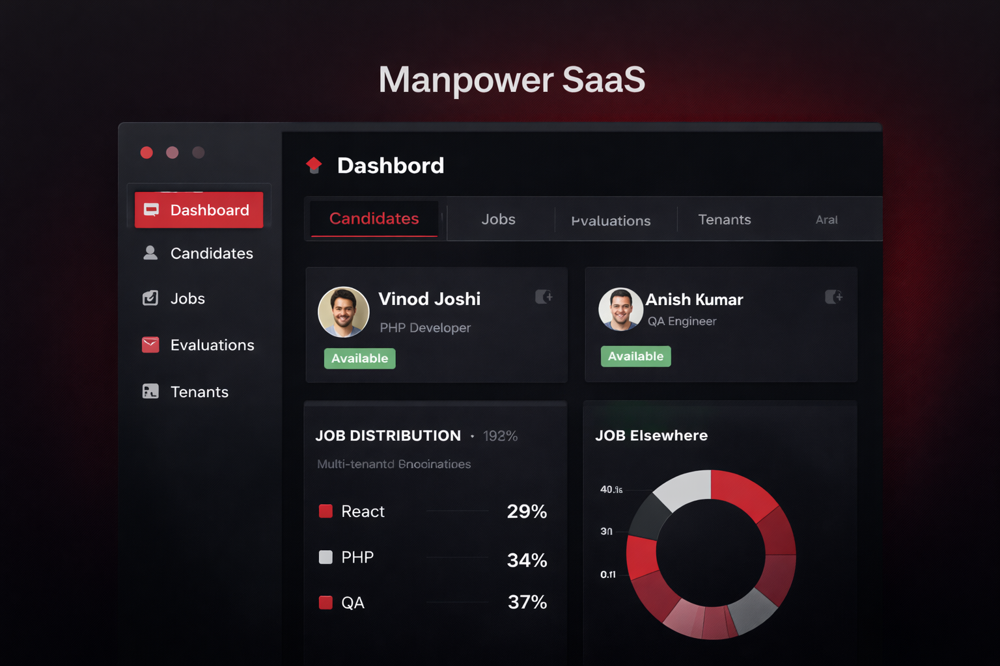
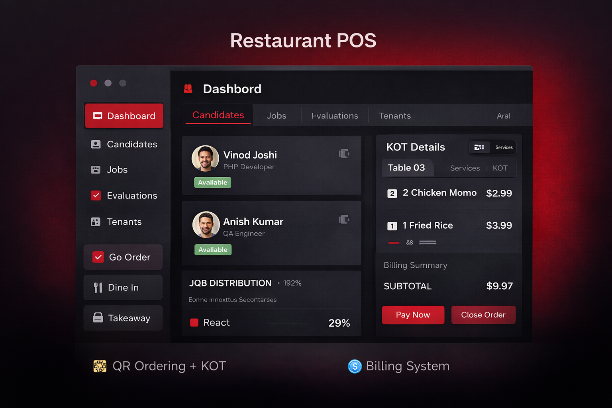

  

<h2 align="center">👋 Hi, I'm Gobinda Sharma</h2>

🎨 UI/UX Designer & Project Manager  
🏢 Pravidhi Digital Innovation  
🚀 Building ERP, SaaS & Dashboard Systems

<a href="https://sharmagobinda.com.np">🌐 Portfolio</a> •
  <a href="https://portfolio2.sharmagobinda.com.np">🌐 Portfolio2</a>
<a href="mailto:bishalladhikari22@gmail.com">📧 Contact</a>

---

## 🚀 What I Do

- 🎨 UI/UX Design (Modern, User-Centered Interfaces)
- 🧑‍💼 Project Management (System Planning & Execution)
- 🧾 ERP System Development (Inventory, Accounting, Reports)
- 📊 SaaS Platforms (Multi-tenant, Role-based Systems)

---

## 💼 Experience

**UI/UX Designer & Project Manager**  
🏢 Pravidhi Digital Innovation  

✔ Managing real-world SaaS & ERP projects  
✔ Designing user-friendly dashboards  
✔ Coordinating development workflows  

---

## 🚀 Featured Projects

### 🧾 ERP System
✔ Inventory, Sales, Purchase  
✔ Financial Reports (P&L, Balance Sheet)  

### 🧑‍💼 Manpower SaaS
✔ Multi-tenant platform  
✔ Candidate privacy system  

### 🍽️ Restaurant POS
✔ QR Ordering + KOT  
✔ Billing + Cash Control  

## 🛠 Tech Stack

React • TypeScript • Django • PostgreSQL • Tailwind
